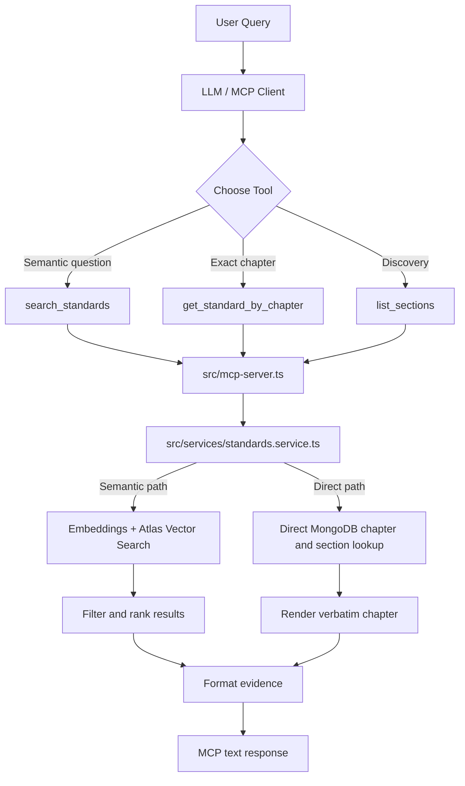

# Healthcare Standards Agent

This project ingests the DNV NIAHO hospital standards PDF, stores chapter-aware vectorized chunks in MongoDB Atlas, and exposes an MCP server for:

- semantic search over the standards corpus
- exact chapter lookup
- section and chapter discovery

The current seeded corpus contains `755` chunks across `184` chapters.

## What It Does

The system supports two retrieval modes:

- Semantic retrieval for natural-language questions such as "What are the staff competency assessment requirements?"
- Exact retrieval for prompts such as "Show me chapter QM.1"

Core behavior:

- parses the source PDF
- chunks content using a section-first strategy
- generates embeddings with Atlas AI Models / Voyage
- stores vectors and structured metadata in MongoDB Atlas
- exposes MCP tools for search and exact lookup
- formats evidence for downstream MCP clients

## Repository Layout

```text
medlaunch_AI/
├── seed-database.ts
├── src/
│   ├── mcp-server.ts
│   ├── db/
│   │   └── mongo.ts
│   ├── services/
│   │   ├── embeddings.ts
│   │   └── standards.service.ts
│   └── utils/
│       ├── cost-estimation.ts
│       └── formatting.ts
├── .env.example
├── package.json
├── TEST_RESULTS.md
├── architecture-flow.svg
└── README.md
```

## Quick Start

### Prerequisites

- Node.js 18+
- MongoDB Atlas cluster
- Atlas AI Models / Voyage API key
- source NIAHO PDF available locally

### Install

```bash
npm install
cp .env.example .env
```

Set at least these values in `.env`:

```env
MONGODB_URI=mongodb+srv://<username>:<password>@<cluster-url>/?appName=Cluster0
VOYAGE_API_KEY=your_model_api_key_here
VOYAGE_EMBEDDINGS_URL=https://ai.mongodb.com/v1/embeddings
EMBEDDING_MODEL=voyage-3-large
```

### Seed and Run

```bash
npm run seed
npm run build
npm run mcp
```

Useful variants:

```bash
npm run seed:dry-run
RESET_COLLECTION=true npm run seed
MAX_CHUNKS=50 npm run seed
npm run mcp:dev
```

## Environment Variables

Important operational settings:

```env
VOYAGE_REQUESTS_PER_MINUTE=300
VOYAGE_TOKENS_PER_MINUTE=100000
MAX_EMBEDDING_BATCH_TOKENS=50000
MAX_EMBEDDING_BATCH_SIZE=12
EMBEDDING_REQUEST_DELAY_MS=250
EMBEDDING_MAX_RETRIES=5
EMBEDDING_RETRY_DELAY_MS=5000

EMBEDDING_COST_PER_1M_TOKENS=0
LLM_INPUT_COST_PER_1M_TOKENS=0
LLM_OUTPUT_COST_PER_1M_TOKENS=0
ESTIMATED_LLM_COMPLETION_TOKENS=0

RESET_COLLECTION=false
DRY_RUN=false
MAX_CHUNKS=0
```

Notes:

- `MAX_CHUNKS=0` means no seed limit.
- If pricing values stay `0`, the system still shows token estimates but dollar estimates remain zero.

## MCP Tools

Primary tools:

- `search_standards(query, top_k)`
- `get_standard_by_chapter(chapter_id)`
- `list_sections(section_filter)`

Expected usage:

- Use `search_standards` for semantic questions.
- Use `get_standard_by_chapter` for exact chapter text.
- Use `list_sections` to discover chapter IDs before exact lookup.

## Example Prompts

- `Use only the healthcare-standards connector. What are the patient rights requirements?`
- `Use only the healthcare-standards connector. Show me chapter QM.1 exactly.`
- `Use only the healthcare-standards connector. Is there a chapter about hand hygiene?`
- `Use only the healthcare-standards connector. Chapters related to patient safety.`

## Architecture

### Request Flow



### Main Components

- `src/mcp-server.ts`: MCP tool registration and dispatch
- `src/services/standards.service.ts`: routing, retrieval, ranking, formatting decisions
- `src/services/embeddings.ts`: query embedding generation
- `src/db/mongo.ts`: MongoDB connection and collection access
- `src/utils/formatting.ts`: evidence formatting and chapter reconstruction
- `src/utils/cost-estimation.ts`: token and cost estimation per query

## Data Model

Stored documents include text, vector data, and metadata for exact retrieval and ranking.

```ts
{
  chunk_id: string,
  text: string,
  metadata: {
    document: string,
    section: string,
    chapter: string,
    chapter_prefix: string,
    heading: string,
    sr_id?: string,
    content_type: 'standard' | 'interpretive_guidelines' | 'surveyor_guidance' | 'chapter_intro',
    parent_block_id: string,
    block_order: number,
    subchunk_index: number,
    subchunk_count: number,
    source_file: string,
    seeded_at: string,
    embedding_model: string,
    embedding_provider: string
  },
  embedding: number[],
  token_count: number
}
```

## MongoDB Atlas Setup

1. Create a cluster.
2. Create database `niaho_standards`.
3. Use collection `standards`.
4. Allow your development IP.
5. Create a database user with read/write access.
6. Create an Atlas AI Models API key for embeddings.

### Vector Search Index

Create vector index `vector_index` on `niaho_standards.standards`:

```json
{
  "fields": [
    {
      "type": "Knnvector",
      "path": "embedding",
      "numDimensions": 1024,
      "similarity": "cosine"
    },
    {
      "type": "filter",
      "path": "metadata.chapter"
    },
    {
      "type": "filter",
      "path": "metadata.chapter_prefix"
    }
  ]
}
```

Recommended additional normal indexes:

- ascending index on `metadata.chapter`
- unique index on `chunk_id`
- ascending index on `metadata.document`

## Chunking Strategy

The seeder uses section-first chunking rather than SR-only slicing.

- target chunk size: `400` to `700` tokens
- hard split threshold: `800` tokens
- overlap: about `60` tokens only when splitting oversized units
- ordering metadata is preserved for exact chapter reconstruction

**Why this approach:**

- keeps more context for embeddings
- reduces fragmented answers
- makes exact chapter reconstruction cleaner
- limits duplicated overlap text

## Cost Tracking

The connector now logs and returns an `estimated_cost` block for each query.

Included estimates:

- embedding tokens used for semantic search queries
- estimated LLM prompt tokens based on query plus MCP response size
- optional estimated LLM completion tokens from env configuration
- estimated USD cost when pricing values are configured

Important limitation:

- this server does not call the final LLM directly, so LLM cost is an estimate of downstream consumption, not an exact billed amount from this process

Example:

```text
estimated_cost:
pricing_configured: true
embedding_tokens_estimate: 18
llm_prompt_tokens_estimate: 264
llm_completion_tokens_estimate: 150
embedding_cost_usd_estimate: 0.000002
llm_prompt_cost_usd_estimate: 0.000132
llm_completion_cost_usd_estimate: 0.000075
total_cost_usd_estimate: 0.000209
```

## Scalability Plan

To scale this from the current single-document prototype to 50+ documents and 10,000+ chunks, the main changes would be:

### Indexing

- keep the vector index on `embedding`
- add normal indexes for `metadata.chapter`, `metadata.document`, and `chunk_id`
- retain filterable metadata fields so vector retrieval can be narrowed before ranking

### Ingestion

- move from full reseeds to incremental ingestion
- track source file version or hash per document
- upsert only changed chunks instead of rebuilding everything
- persist ingestion progress for restartable long-running jobs

### Caching

- cache query embeddings for repeated prompts
- cache rendered chapter output for common exact lookups such as `QM.1`
- cache frequent semantic search responses with short TTLs

### Database Growth

- a single indexed Atlas collection is fine for moderate growth
- if sharding becomes necessary, shard on a high-cardinality source or tenant key rather than chapter ID
- keep exact lookups targeted through normal indexes so they stay cheap

### Application Changes

- keep metadata filtering, candidate generation, ranking, and formatting as separate stages
- add structured response metadata if you later want analytics dashboards or richer clients
- move cost and query telemetry into centralized logging for monitoring

## Testing

Run the smoke suite:

```bash
npm test
```

Validated during development:

- `npm run build`
- `npm run seed:dry-run`
- `RESET_COLLECTION=true npm run seed`
- exact chapter lookups including `IC.1`, `QM.1`, `LS.2`
- semantic retrieval checks for patient rights, hand hygiene, medication errors, and staff competency questions
- local MCP client validation through Claude-compatible workflows

Detailed examples are in `TEST_RESULTS.md`.

## Claude Desktop Setup

Build the server first:

```bash
npm run build
```

Then add this to `~/Library/Application Support/Claude/claude_desktop_config.json`:

```json
{
  "mcpServers": {
    "healthcare-standards": {
      "command": "node",
      "args": [
        "/Users/varunreddyseelam/Desktop/medlaunch_AI/dist/mcp-server.js"
      ]
    }
  }
}
```

Restart Claude Desktop after saving the config.

## Scripts

```bash
npm run build
npm run seed
npm run seed:dry-run
npm run mcp
npm run mcp:dev
npm run test
```

## Design Choices

### Dual retrieval modes

The challenge needs both semantic search and exact citation lookup. Keeping both in one service makes the MCP layer simpler and avoids pushing retrieval logic into the client.

### Section-first chunking

Very small SR-only chunks improved precision but often lost context. Section-first chunking gives embeddings more meaningful context while still keeping chunk sizes controlled.

### Thin MCP layer

`src/mcp-server.ts` only registers tools and dispatches requests. Retrieval and formatting logic stay in services so they are easier to reason about and test.

### Conservative embedding controls

Batch limits, retry delays, and cost estimation make seeding slower but more predictable and easier to operate.

## Known Limitations

- answer quality still depends on the downstream model following retrieved evidence faithfully
- PDF extraction artifacts may still survive in some edge cases
- LLM cost is estimated, not directly metered from the client runtime
- the automated tests are still a lightweight smoke suite, not a full regression suite

## Troubleshooting

### `MONGODB_URI environment variable is required`

Set `MONGODB_URI` in `.env`.

### Semantic search falls back to text search

Usually `VOYAGE_API_KEY` is missing or the embedding request failed.

### Seeder fails during embeddings

Check:

- API key
- Atlas/network access
- batch limits
- retry settings

### Exact chapter lookup returns nothing

Check:

- the collection is seeded
- the chapter exists in `metadata.chapter`
- the chapter format matches stored values such as `QM.1` or `LS.2`

## Submission Notes

Implemented in this repository:

- seeder
- MCP server
- retrieval logic
- environment template
- README
- test results

Manual artifacts still useful for final submission:

- Atlas cluster screenshot
- Atlas collection screenshot
- Atlas vector index screenshot
- MCP client screenshots or screen recording
- Test Demo recording: https://drive.google.com/file/d/1_KRqlbhahAX-bXnzOPrjN8bnw4uvVQJI/view?usp=sharing
- GitHub repository: https://github.com/Ramreddy2748/agent_orchestartion